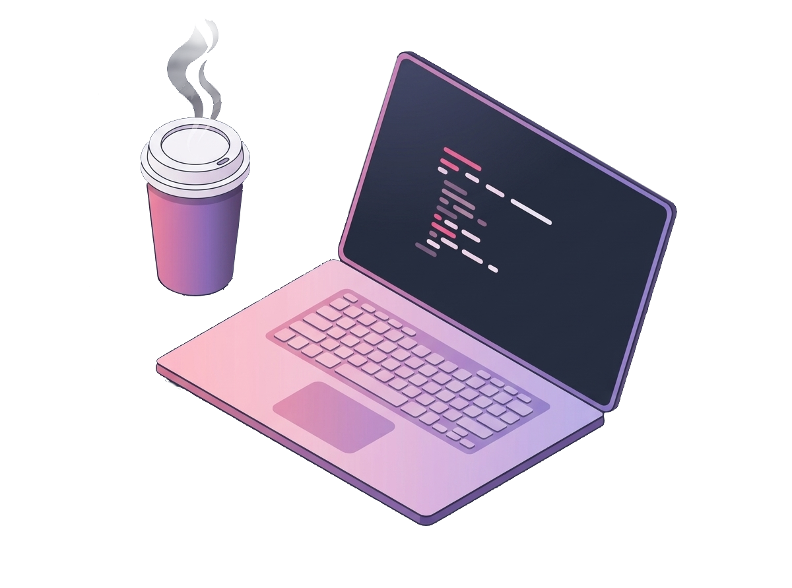

<h2>Olá, sou Maurício.</h2>

  Estudante de engenharia de software e com experiência em backend, documentação e projetos colaborativos usando <strong>Java</strong>, <strong>Spring Boot</strong> e <strong>PostgreSQL</strong>. Também desenvolvo projetos em <strong>C++, Linux</strong> e sistemas embarcados.
    
  Atualmente estudo princípios de AWS, orquerstramento de LLMs, algoritmos de otimização de rotas, arquitetura e qualidade de sistemas.

---

  🦄 Linguagens: <strong>Java, C++, JavaScript, SQL</strong>

  📚 Frameworks e Bibliotecas: <strong>Spring, Node.js, React</strong>

  💼 Ferramentas: <strong>Docker, PostgreSQL</strong>

  📝 Estudos: <strong>AWS, LLMs, algoritmos de otimização</strong>

---

  ☑️ Destaques: <ul>
  <li><strong>Finalista da Maratona SBC de Programação 2025;</strong></li>
  <li><strong>Monitor bolsista na UEPA</strong></li>
  </ul>

  💌 Sinta-se à vontade para entrar em contato comigo: ⤵️

  
  

